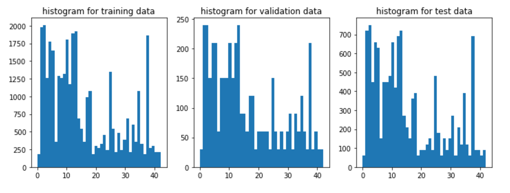
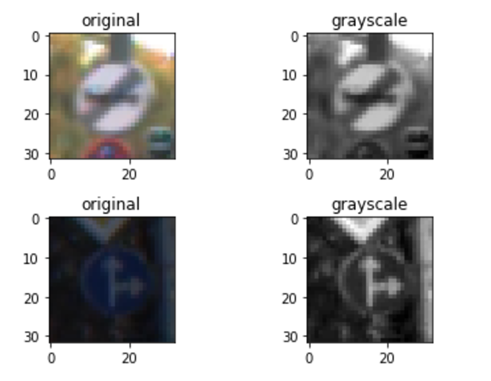
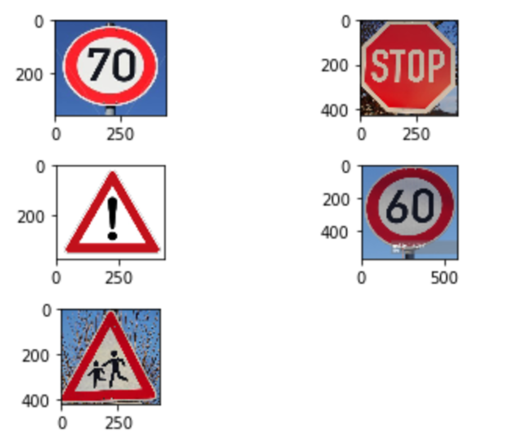

#**Traffic Sign Recognition**

##Writeup Template

###You can use this file as a template for your writeup if you want to submit it as a markdown file, but feel free to use some other method and submit a pdf if you prefer.

---

**Build a Traffic Sign Recognition Project**

The goals / steps of this project are the following:
* Load the data set (see below for links to the project data set)
* Explore, summarize and visualize the data set
* Design, train and test a model architecture
* Use the model to make predictions on new images
* Analyze the softmax probabilities of the new images
* Summarize the results with a written report

## Rubric Points
###Here I will consider the [rubric points](https://review.udacity.com/#!/rubrics/481/view) individually and describe how I addressed each point in my implementation.  

---
###Writeup / README

####1. Provide a Writeup / README that includes all the rubric points and how you addressed each one. You can submit your writeup as markdown or pdf. You can use this template as a guide for writing the report. The submission includes the project code.

You're reading it! and here is a link to my [project code](https://github.com/udacity/CarND-Traffic-Sign-Classifier-Project/blob/master/Traffic_Sign_Classifier.ipynb)

###Data Set Summary & Exploration

####1. Provide a basic summary of the data set. In the code, the analysis should be done using python, numpy and/or pandas methods rather than hardcoding results manually.

I used the pandas library to calculate summary statistics of the traffic
signs data set:

* The size of training set is 34799
* The size of the validation set is 12630
* The size of test set is 4410
* The shape of a traffic sign image is 32x32x3
* The number of unique classes/labels in the data set is 43

####2. Include an exploratory visualization of the dataset.

Here is an exploratory visualization of the data set. It is a bar chart showing how the data for each class is distributed. We can see from this chart that the training, testing and validation sets have similar distribution for different classes

###Design and Test a Model Architecture

####1. Describe how you preprocessed the image data. What techniques were chosen and why did you choose these techniques? Consider including images showing the output of each preprocessing technique. Pre-processing refers to techniques such as converting to grayscale, normalization, etc. (OPTIONAL: As described in the "Stand Out Suggestions" part of the rubric, if you generated additional data for training, describe why you decided to generate additional data, how you generated the data, and provide example images of the additional data. Then describe the characteristics of the augmented training set like number of images in the set, number of images for each class, etc.)

For data preprocessing, I first tried just using the normalized original images to feed into the model. Normalizing the data is good for the model to perform back propagation gradient decent therefore making the model more robust.

After several trials with the original images, I decided to convert the them into grayscale, as I don't think the traffic signs color is adding a lot more predictive power to the model. converting the image to grayscale also reduce the dimension of the input to 1/3 of the original input, which greatly lower the complexity of the model

Here is an example of a traffic sign image before and after grayscaling.

####2. Describe what your final model architecture looks like including model type, layers, layer sizes, connectivity, etc.) Consider including a diagram and/or table describing the final model.

My final model consisted of the following layers:

| Layer         		|     Description	        					|
|:---------------------:|:---------------------------------------------:|
| Input         		| 32x32x1 grayscale image   							|
| Convolution 1 5x5x1x16     	| 1x1 stride, valid padding, outputs 28x28x16 	|
| RELU					|												|
| Max pooling	      	| 2x2 stride,  outputs 14x14x16 				|
| Convolution 2 5x5x16x64	    | 1x1 stride, valid padding, outputs 10x10x16     			|
| RELU					|												|
| Max pooling	      	| 2x2 stride,  outputs 5x5x64 				|
| Fully connected layer 1		| input 1600, output 400  									|
| dropout		| 0.75     									|
| Fully connected layer 2		| input 400, output 120														|
| dropout		| 0.75     									|
| Fully connected layer 3		| input 120, output 84  						     									|
| dropout		| 0.75     									|
| Fully connected layer 4		| input 84, output 43  						     									|
| Softmax				| input 43, ouput 43        									|

####3. Describe how you trained your model. The discussion can include the type of optimizer, the batch size, number of epochs and any hyperparameters such as learning rate.

To train the model, I used the Adam optimizer. I set the batch size to 128, train the model on 50 epochs and the learning rate is 0.001.

####4. Describe the approach taken for finding a solution and getting the validation set accuracy to be at least 0.93. Include in the discussion the results on the training, validation and test sets and where in the code these were calculated. Your approach may have been an iterative process, in which case, outline the steps you took to get to the final solution and why you chose those steps. Perhaps your solution involved an already well known implementation or architecture. In this case, discuss why you think the architecture is suitable for the current problem.

My final model results were:
* training set accuracy of 0.998
* validation set accuracy of 0.954
* test set accuracy of 0.940

If an iterative approach was chosen:
* What was the first architecture that was tried and why was it chosen?
  * The first architecture chosen was the LeNet architecture. It is chosen because it seems to work very well on the MNIST image dataset and it should be a very good starting point for the traffic sign classfication task.
* What were some problems with the initial architecture?
  * The initial problem with the initial architecture is that there is only one convolution layer with the filter size 5x5x3x6. First of all, the layer of the filter is too small and it is not able to fully capture the characteristics of a traffic as the traffic sign images has more complexity and depth than the MNIST number images.
* How was the architecture adjusted and why was it adjusted? Typical adjustments could include choosing a different model architecture, adding or taking away layers (pooling, dropout, convolution, etc), using an activation function or changing the activation function. One common justification for adjusting an architecture would be due to overfitting or underfitting. A high accuracy on the training set but low accuracy on the validation set indicates over fitting; a low accuracy on both sets indicates under fitting.
  * There are several things that I have adjusted to the original LeNet architecture:
    * I change the filter size of the first convolutional layer to 5x5x1x16 to better capture the information on a traffic sign image
    * I added one more convolutional layer with filter size 5x5x16x64 to make the layer output with 64 stacked layers to enrich the input to the fully connected layer.
    * Originally there were only 3 fully connected layers in the LeNet architecture. I added one more and lowering the dimension of the output from one layer to the other. Since the output dimension from the second convolutional layer is 1600, which is 4 times as many as that in the MNIST lab, I think adding one more fully connected layer will make the model learn better and prevent overfitting.
    * Originally I didn't use dropout. After I added the dropout in the architecture, the model has a slight increase in validation accuracy. It helped in preventing model overfitting.
* Which parameters were tuned? How were they adjusted and why?
  * The parameters that I tuned the most was the epochs. Since we are using the gaussian gradient decent, feeding in more epochs allow the model to learn with the full dataset, however it increases the runtime. Eventually I decided to use 50 epochs as I found the runtime was not changing so much with the fast GPU computing on AWS.
  * Another parameters I tuned was the learning rate. I tried to lowering the learning rate 0.0005, but the result wasn't improving much. So I decided to keep the 0.001 as higher learning rate reduce the runtime of the model.
  * Also I tried changing the dropout rate to 0.5, but the performance didn't improve much.
* What are some of the important design choices and why were they chosen? For example, why might a convolution layer work well with this problem? How might a dropout layer help with creating a successful model?
  * Instead of just feeding in the flattening images directly to the model, convolution layers help preserve the relative relationship between each pixel and their neighbors, therefore allowing the model to learn non-linear relationship within the image much better.
  * A dropout layer with 0.75 randomly drops 75% of the activation output to force the model to learn from redundant output from activation, preventing the model from relying on an single activation output. The activation layer has act on certain behavior multiple times in order to have back propagation react to it, making the model more robust and prevent overfitting.
  * Using a relu instead of a sigmoid function in the activation prevent the gradient from vanishing during back propagation.

###Test a Model on New Images

####1. Choose five German traffic signs found on the web and provide them in the report. For each image, discuss what quality or qualities might be difficult to classify.

Here are five German traffic signs that I found on the web:

The fourth image might be difficult to classify because it has a water mark on it. The fifth traffic sign might be hard to classify because the background has noise and other objects.

####2. Discuss the model's predictions on these new traffic signs and compare the results to predicting on the test set. At a minimum, discuss what the predictions were, the accuracy on these new predictions, and compare the accuracy to the accuracy on the test set (OPTIONAL: Discuss the results in more detail as described in the "Stand Out Suggestions" part of the rubric).

Here are the results of the prediction:

| Image			        |     Prediction	        					|
|:---------------------:|:---------------------------------------------:|
| 4,Speed limit (70km/h)      		| 4,Speed limit (70km/h)   									|
| 14,Stop    			| 14,Stop 										|
| 18,General caution					| 18,General caution											|
| 3,Speed limit (60km/h)	      		| 18,General caution 				 				|
| 28,Children crossing			| 28,Children crossing     							|

The model was able to correctly guess 4 of the 5 traffic signs, which gives an accuracy of 80%. The testing accuracy is 0.940 which is higher than the accuracy of the five web traffic signs.

####3. Describe how certain the model is when predicting on each of the five new images by looking at the softmax probabilities for each prediction. Provide the top 5 softmax probabilities for each image along with the sign type of each probability. (OPTIONAL: as described in the "Stand Out Suggestions" part of the rubric, visualizations can also be provided such as bar charts)

The code for making predictions on my final model is located in the 11th cell of the Ipython notebook.

For the first image, the model is relatively sure that this is a stop sign (probability of 0.9), and the image does contain a speed limit (70km/h). The top five soft max probabilities were
| Probability         	|     Prediction	        					|
|:---------------------:|:---------------------------------------------:|
| .900         			| 4,Speed limit (70km/h)   									|
| .091     				| 18,General caution 										|
| .001					| 31,Wild animals crossing											|
| .000	      			| 39,Keep left					 				|
| .000				    | 25,Road work     							|

For the second image, the model is relatively sure that this is a stop sign (probability of 0.995), and the image does contain stop sign. The top five soft max probabilities were

| Probability         	|     Prediction	        					|
|:---------------------:|:---------------------------------------------:|
| .995         			| 14,Stop   									|
| .004     				| 1,Speed limit (30km/h) 										|
| .000					| 4,Speed limit (70km/h)										|
| .000	      			| 0,Speed limit (20km/h)					 				|
| .000			    | 33,Turn right ahead      							|

For the Third image, the model is 100% sure this is a general caution sign.

| Probability         	|     Prediction	        					|
|:---------------------:|:---------------------------------------------:|
| 1.000         			| 18,General caution  									|

For the fourth image, which we predicted wrong, the model is relatively sure that this is a general caution sign (probability of 0.929), and the actual image is a Speed limit (60km/h). The top five soft max probabilities were

| Probability         	|     Prediction	        					|
|:---------------------:|:---------------------------------------------:|
| .929         			| 18,General caution   									|
| .058     				| 31,Wild animals crossing (30km/h) 										|
| .012					| 20,Dangerous curve to the right (70km/h)										|
| .000	      			| 29,Bicycles crossing (20km/h)					 				|
| .000			    | 23,Slippery road     							|

For the fifth image, the model is 100% sure the traffic sign is Children Crossing and it is correct.

| Probability         	|     Prediction	        					|
|:---------------------:|:---------------------------------------------:|
| 1.000         			| 28,Children crossing   									|

### (Optional) Visualizing the Neural Network (See Step 4 of the Ipython notebook for more details)
####1. Discuss the visual output of your trained network's feature maps. What characteristics did the neural network use to make classifications?
